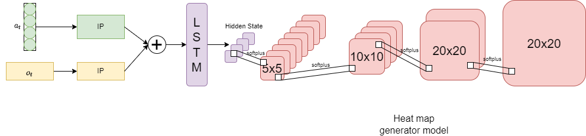
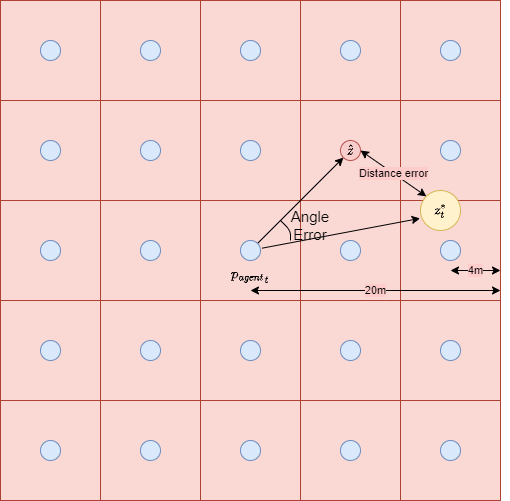

# chemical_source_localization

## Network structure

## Main Requirements
* python 3.8+
* pytorch 1.4+
* numpy
* matplotlib

## Generate data
1. Please run generataData/generateData.ipynb
2. Change env_arg, agent_arg, source_arg and water_arg to create different scenario, for examples:
 - Env_arg:
  + Water_flow_force_shape, water_flow_force_scale: Water flow Gamma distribution
  + Episode_limit: Length of each episode
 - Agent_arg:
  + action_mode: The predefined trajectory of agent. For examples, 2=> stochastic trajectory, 1=> Spiral trajectory, 0 => Onward trajectory
  + dt : agent velocity ( in simulation units)
  + radius: agent's sensing range
 - source_arg:
  + source_pos_shape, source_pos_scale: Source distance distribution
  + decay_rate: chemical concentration decay rate
  + spawn_scale: spawn rate of chemical packet
  + concentration_threshold: The concentration threshold to consider if the packet disapear
  + min_concentration, max_concentration: Source's initialized concentration normal distribution
  + burn_in: The simulation start when the chemical plume is formed.
 - water_arg:
  + energy: Energy of turbulent
  + length_scale: Characteristic length
 3. Raw generated episode data is saved in output/data/

## Preprocess Data
1. Please run generateData/processVoroniData.ipynb
2. Change file_type ('stochastic', 'cyclone', 'oneway')
3. The preprocess includes calculating distance between agent vs source, calculate the distance of each centroids of heat map to the source (with different heatmap resolution), combine the observation (concentration, waterflowforce), etc.

## Trained model
1. Please run test/test_LSTM.ipynb
2. 
